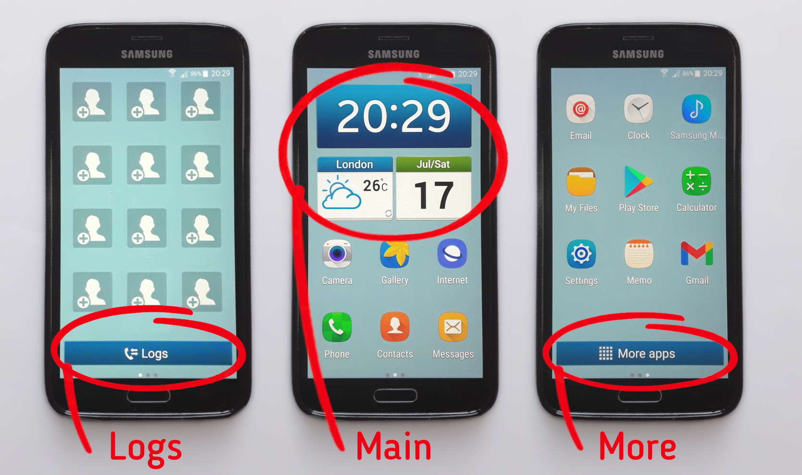
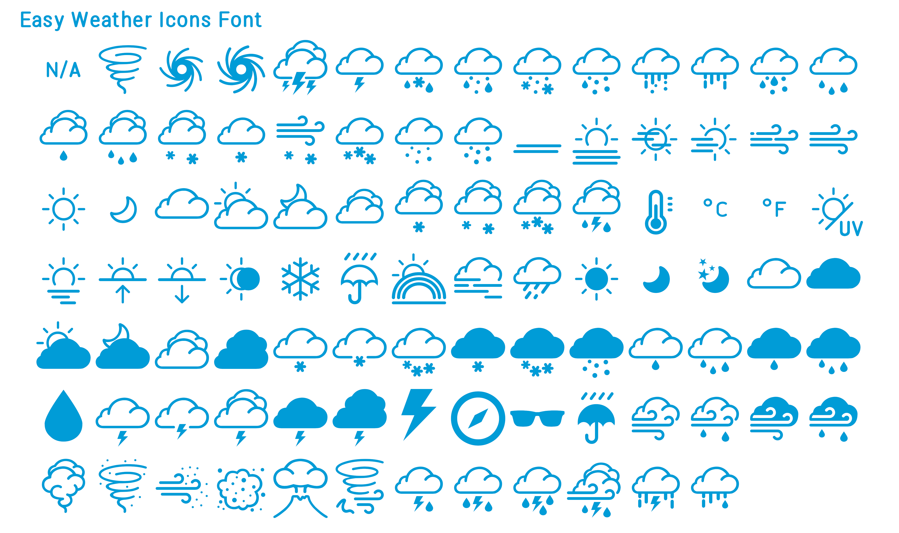

# Easy Mode Replica Widgets

[Download the KWGT widgets (they're free!)](https://github.com/boxbot6/easy-mode-replica-widgets/raw/main/downloads/easy-mode-replica-widgets.zip)

 

These 3 free widgets help to replicate the look of Samsung's Easy Mode (from a Galaxy S4) onto a large variety of newer android phones for people who like the simplicity of this retro-style display or who might find changing to a new layout difficult (the widgets are displayed on the phone by using a great android app called 'KWGT Kustom Widget Maker' which you can [download from the Play Store.](https://play.google.com/store/apps/details?id=org.kustom.widget&gl=US)

For simplicity you can also use just the 'Main' one on its own with KWGT as a simple clock, date and weather widget.

Shown above working on my Samsung Galaxy S5, but should work on any make of phone that can use the KWGT app. (For the pics above I also used some extra optional settings to complete the "Easy Mode" look that are described later below in **'Additional Setup For The Easy Mode Look'** - for example these included using the app 'Nova Launcher' to adjust the grid dimensions and size of the icons).

[Download .zip](https://github.com/boxbot6/easy-mode-replica-widgets/raw/main/downloads/easy-mode-replica-widgets.zip)

## Files included:
* easy-mode-replica-widget-main.kwgt
* easy-mode-replica-widget-logs.kwgt
* easy-mode-replica-widget-more.kwgt
* folder-of-extra-files (includes Galaxy S4 Icon Pack, Wallpapers and an older version of the KWGT app)

 

## To use:
Install the [KWGT Kustom Widget Maker](https://play.google.com/store/apps/details?id=org.kustom.widget&gl=US) app on your phone from the Google Play Store (to optimally install the widgets use the pro version - or for use with the free version see the **'Without Pro workarounds'** further below) - Please note: after you install KWGT for the first time, open it and allow it to automatically create the folder 'Kustom' in the phones main 'Internal storage' directory before following the instructions below.

#### With Pro:
  - Download and unzip the file on your phone or tablet.
  - Move the .kwgt files from the download to your phones internal storage folder Kustom/widgets.
  - On your phone find a home screen with some free space and create a new widget by long-pressing on an empty area of the screen and then select 'Widgets' from the prompt that appears at the bottom of the screen.
  - Scroll through all the widgets that are shown and choose the 'Kustom Widget' group.
  - Then choose the KWGT 2 x 2 template and drag it to your home screen and create the blank widget.
  - If the resizable borders are not showing, long-press the widget to activate them and then resize it to the dimensions as below (click anywhere outside the widget to close the resizable borders).  
  - Resize the new widget by dragging its borders to match the example widget sizes below - (basically make the widgets fill the width of the screen and keep the height in proportion for the main widget and fixed at 1 icon high for the two buttons.

    **'Example Widget Sizes'**  
    - Main widget 3x2 icons (high-res phones 4x3) (large screen phones 5x4).  
    - Logs widget 3x1 icons (high-res phones 4x1) (large screen phones 5x1).  
    - More apps widget 3x1 icons (high-res phones 4x1) (large screen phones 5x1).  

  - (Close the resizable borders by clicking outside of the widget and then continue as below).
  - Click on the blank widget to set it up - this will open the KWGT editor where you can select the Library at the bottom and then scroll down until you find the widget you want and then press it to add the contents to the blank widget.
  - Once added, if the widget doesn't automatically fill all the available space properly press the **LAYER** tab (may be hidden off-screen to the right of the **ITEMS** and **BACKGROUND** tabs near the top right of the editor) and then **Scale** with - or + to make it as large as possible within the widget without going over the edges.
  - You can also adjust the **Location** presets below the **Scale** field at this time if needed (set if you aren't allowing permission to access location services for KWGT).  
  - Save by pressing the floppy disk icon at the top of the editing screen.
  - Press Back Button or Home Button to leave editor.
  - Repeat for all 3 widgets.

  - Don't forget to give KWGT permissions and turn on location services if you want to get weather information - (you may also have to reset the location services by turning them off and on again after you have created the widgets to get it working for the first time!)   

 

**Note:** If the created widgets look odd or don't fit your screen as expected - (dependent on the aspect ratio of your device it is possible the imported files may not fill the width of the blank widgets correctly) - if this happens please experiment by recreating the widgets again but with slightly different aspect ratios other than those used in **'Example Widget Sizes'** above).
  - By Googling how to use KWGT you can change, fix, turn off any of the touch actions etc. for your own purpose (along with many other options).
  - For simplicity you can just turn off all the touch actions for the widgets by editing the widget in KWGT (by using TOUCH>Action>None for each of the ITEMS that have touch actions set).
  - Probably won't be necessary but if the icons and fonts don't show as you expect you might also have to manually add **all the files** contained in the downloads (fonts) and (icons) folders to the devices 'Kustom/fonts' and 'Kustom/icons' folders respectively (usually only a problem if you are copying or creating new widets without following the import method above).

**If the touch Actions don't work:** To change what the touch actions on the widgets do see **'Example to change a touch action for use on a different phone using KWGT'** further below. 

 
 
If Nova Launcher is installed it permits you to more accurately resize and locate the widgets after you have made them - you can set the widget borders at 1/2 an icon height so that they fit the buttons tighter without leaving space above and below and allowing for better placement of them on the screen (if you dont have Nova Launcher don't worry, 1 icon height is fine, the widgets will just be placed further apart).

The widgets were made initially to work for my Samsung Galaxy S5 (as shown above) which does have Nova Launcher installed (to customise the look and spacing of the icons) and the BBC weather app installed that opens up on pressing the weather side of the main widget (so it may be a good idea to install those on your phone as well - see details in Additional Setup below).

The widgets happily work on many other phones, however please note that as there are so many different makes/models of phone and versions of android that not every feature may work instantly with your phone and so you will probably have to use KWGT to re-open the widgets and edit if any glitches appear for your device (eg. change what the touch actions on the widgets do (or don't do), adjust the widget size, layouts etc.) - please refer to online examples for using KWGT - I've given a typical example below of how to change a touch action. 

#### Example to change a touch action for use on a different phone using KWGT:

For the Main widget - opening the calendar when the date is pressed.

e.g. On a Samsung Galaxy A40 the calendar is opened by using the Calendar app, however on a Samsung Galaxy S5 the calendar is opened using the S Planner app.

  - By default when the date 'Shape' rectangle is pressed the Main widget opens: TOUCH>Launch App>Calendar - so on a Samsung Galaxy A40 this works OK without any change needed at all. 
  - To edit for use on a Samsung Galaxy S5 - use KWGT to open and change the Main widgets TOUCH action for the date 'Shape' rectangle to: TOUCH>Launch App>S Planner.

(Note: as you can see here, even the same brand of phone has differences between models so nothing is universal for these settings I'm afraid so you may have to do a little research to find out what works for your device).

#### How do I know what to use for my phone?
  - To see what touch actions will work on your device - use KWGT to edit a widget and scroll through the options listed in the SHAPE>TOUCH>Action>(and then each of the sub-menus listed) - here you will find the available options specific to your device.
  - You may have difficulty accessing some of the system features which can be restricted on many phones, so for functions like 'call logs', 'more apps' or other system actions and you might have to install a third-party app like Nova Launcher and then use alternatives like Nova Actions in the Action menu. e.g. TOUCH>Launch Shortcut>Nova action>App drawer for a list of other installed apps to replicate the Samsung system 'More apps'.
  - For ease of setup first try to copy actions that already work in other apps or widgets on your device.
  - Dependent on your phone/android version/apps you have installed, you may need to experiment to find alternative targets on your device or search online to find apps with targets or actions that do similar things to those you want to replicate, but don't get too obsessed with exactly recreating everything - remember these widgets may visually look like Samsungs operating system but they are only widgets that run on top of your own operation system so be realistic about exactly replicating all the easy mode features on every other phone or tablet - they may be restricted or not available on your device - you can always turn off the touch actions for features that you can live without by using TOUCH>Action>None.

 

### Additional Setup For The Easy Mode Look:
  - Set the easy mode background wallpaper (samsung-easy-mode-wallpaper.jpg) from the download's additional-files/easy-mode-replica-widgets-(backgrounds) folder.
  - Install BBC weather app (default target of pressing the weather symbol side of the main widget) or use KWGT to edit and change the TOUCH>Launch App>(target) for the weather 'Shape' rectangle to open the weather app of your choice (or set TOUCH>Action>None to dissable it - likewise to dissable any of the other touch actions).
  - Download and install Nova Launcher app if you don't already have it installed - with this you can set the phones icon grid dimensions, resize and locate the widgets more accurately, edit the Home screen, change the button actions, lock the layout, change the icons, etc. etc. - please refer to online examples for how use all the additional features of Nova Launcher.
  - Some sample settings for the Easy Mode look with Nova Launcher - use the following settings for Home Screen:

      Desktop grid: 4 x 3  
      Icon layout: 150%, Labels: On  
      Padding: None x None  
      Dock: Enable: Off  

  - If Nova Launcher is installed it permits you to more accurately resize and locate the widgets after you make them - you can set the widget borders at 1/2 icon height so that they fit the buttons tighter without leaving space above and below and allowing for better placement of them on the screen (if not 1 icon height is fine, the widgets will just be placed further apart).
  - With Nova Launcher installed you should be able to access and add the 'Favourite Contacts' widget to the first page from the phones home screen widgets prompt (resize it upwards slightly to allow for the Logs button widget to fit at the bottom). 

  - Home button:

      Nova Launcher allows you to set a physical Home button to open 'Recent Apps' with a double-press.
      Alternatively you can install the 'Buttons remapper' app (I used Version 1.19.0) to set a physical Home button to open 'Recent Apps' with a long-press as on the original Galaxy S4 easy-mode.
      or just leave 'as is' on your new device.

 

### Without Pro workarounds - a couple of things you can try (Tested and works on KWGT version 3.58b and 3.73b - update: these without Pro workarounds don't seem to work on 3.79b and later, so just sideload an older version, I'll add an older.apk to the download):
  - Install the free version of the [KWGT Kustom Widget Maker](https://play.google.com/store/apps/details?id=org.kustom.widget&gl=US) app on your phone from the Google Play Store - after installing KWGT open it for the first time and allow it to create the folder 'Kustom' in the phones main 'Internal storage' directory before following the instructions below.
   - You will need to play around and experiment with KWGT for a little while after installing it - creating, saving and exporting some test widgets to allow it to create an 'autosave' folder for your work within 'Kustom' (if you already have KWGT installed it will probably already have this folder or you can just create it yourself). 
  - Download and unzip the file on your device.
  - Move the .kwgt files from the download to your phones internal storage folder Kustom/autosave.
  - On your phone find a home screen with some free space and create a new widget by long-pressing on an empty area of the screen and then select 'Widgets' from the prompt that appears at the bottom of the screen.
  - Scroll through all the widgets that are shown and choose the 'Kustom Widget' group.
  - Then choose the KWGT 2 x 2 template and drag it to the free space on your screen and create the blank widget.
  - If the resizable borders are not showing, long-press the widget to activate them and then resize it to the dimensions as below (click anywhere outside the widget to close the resizable borders).  
  - Resize the new widget by dragging its borders to match the example widget sizes below - (basically make the widgets fill the width of the screen and keep the height in proportion for the main widget and fixed at 1 icon high for the two buttons.

    **'Example Widget Sizes'**  
    - Main widget 3x2 icons (high-res phones 4x3) (large screen phones 5x4).
    - Logs widget 3x1 icons (high-res phones 4x1) (large screen phones 5x1).
    - More apps widget 3x1 icons (high-res phones 4x1) (large screen phones 5x1).
     
  - (Close the resizable borders by clicking outside of the widget and then continue as below). 
  - Click on the blank widget to set it up - this will open the KWGT editor where you can select **'Backups'** at the bottom right (hopefully contains your files masquerading as backups from the autosave folder where you put them above) - scroll through the widgets to find those you moved there and press the one you want to try to add it to the blank widget.
  - Once added, if the widget doesn't automatically fill all the available space properly press the **LAYER** tab (may be hidden off-screen to the right of the **ITEMS** and **BACKGROUND** tabs near the top right of the editor) and then **Scale** with - or + to make it as large as possible within the widget without going over the edges.
  - You can also adjust the **Location** presets below the **Scale** field at this time if needed.
  - Save by pressing the floppy disk icon at the top of the editing screen.
  - Press Back Button or Home Button to leave editor.
  - Repeat for all 3 widgets.

  - (If the created widgets look odd or don't fit your screen as expected - (dependent on the aspect ratio of your device it is possible the imported items may not fill the width of the blank widgets correctly) - if this happens please experiment by recreating the widgets again but with slightly different aspect ratios than those used above).
  - By Googling how to use KWGT you can change, fix, turn off any of the touch actions etc. for your own purpose (along with many other options).
  - Probably won't be necessary but if the icons and fonts don't show as you expect you might also have to add **all the files** contained in the downloads (fonts) and (icons) folders to the devices Kustom/fonts and Kustom/icons folders respectively (usually only a problem if you are copying or creating new widets without following the import method above).

  - Don't forget to give KWGT permissions and turn on location services if you want to get weather information - (you may also have to reset the location services by turning them off and on again after you have created the widgets to get it working!)   

  or

  - Very time consuming but you could open each .kwgt file by unzipping it (it's just a renamed .zip file), open the file inside called 'preset.json' in a text editor (Notepad) and manually copy all the module settings shown there to a brand new KWGT widget made using the free version of KWGT (as you are making a new widget here you will also need to add **all the files** contained in the downloads (fonts) and (icons) folders to the devices Kustom/fonts and Kustom/icons folders respectively and also load the background images for the widgets from the downloads additional-files/easy-mode-replica-widgets-(backgrounds) folder).

 

## Troubleshooting:

- Give app permissions.

- To get the weather location working (and showing the correct icons) you may have to turn the phones location off and on again after installing the app.

- If it doesn't work - the widgets happily work as they are on many phones, however please note that as there are so many different makes/models of phone and versions of android it is possible that some of the features may not work instantly on your phone. If something doesn't work please refer to the general fixes below.

- Check if other KWGT widgets work on your device.

- General glitches with the widgets - if these happen you will probably have to use KWGT to open and edit the widgets to fix any problems that appear on your specific device (eg. change what the touch actions on the widgets do (or don't do), adjust the widget size, layouts, text, rotation, etc.) - please refer to online examples of how to use KWGT.

- Touch actions not working - check the apps and links for the touch actions are installed. If needed open the widget with KWGT and edit the touch settings as in the 'Example to change a touch action for use on a different phone' shown previously further above. (Dependent on your phone/android version/apps you have installed, you may need to experiment to find alternative touch action targets on your device or search online to find apps with targets or actions that do similar things to those you want to replicate, but don't get too obsessed with exactly recreating everything - remember these widgets may visually look like Samsungs operating system but they are only widgets that run on top of your own operation system so be realistic about exactly replicating all the easy mode features on every phone or tablet - they may be restricted or not available on your device, you can always turn off the touch actions for features that you can live without by using TOUCH>Action>None).

- Although this setup is designed to visually look Like Samsungs Easy Mode running on Android 4.4.2 it is programmed completely differently and so it is useable on other manufacturers android devices that run KWGT (however unusual devices and screen sizes will probably need some editing).

- Check the contents of your devices Kustom/fonts and Kustom/icons internal storage folders - if you are copying or creating new widets you will need to add **all the files** contained in the downloads (fonts) and (icons) folders to the devices Kustom/fonts and Kustom/icons folders respectively and also load the background images for the widgets from the downloads additional-files/easy-mode-replica-widgets-(backgrounds) folder.

- Horizontal rotation problems and use on tablets - try using the download's tablet versions from additional-files/easy-mode-replica-widgets-(tablet-versions) instead.

- **Note:** If the created widgets look odd or don't fit your screen as expected - (dependent on the aspect ratio of your device it is possible the imported files may not fill the width of the blank widgets correctly) - if this happens please experiment by recreating the widgets again but with slightly different aspect ratios other than those used in **'Example Widget Sizes'** above).

- Save a lot of hassle by upgrading to KWGT pro (it is a great app once you learn and get used to it).

 

## Standalone App:

I have also combined the three widgets into a standalone app which doesn't need to use KWGT, however attempting to make the app as compatible as possible has been a bit of a pain, it sort of works for a few months until Android gets updated and ever more restrictive to third party apps so there are still a few bugs on some models of phone to be sorted out. It can be downloaded at the link below together with the Android Studio files that I used to make it (these may also be useful as examples for those who wish to make their own weather apps).

(If it doesn't work for you, please stick to the KWGT widgets version above). 

link to the standalone app here: <https://boxbot6.github.io/easy-mode-replica-app>

 

---

 

## References:

These widgets are designed to look like Samsung Easy Mode running on Android 4.4.2 (Galaxy S4 mini version).

Tested on KWGT Kustom Widget Maker app version 3.58b

The main widget contains my 'easy-weather-icons-font.ttf' to show the weather conditions, it can be found for free use in your own projects at this link: <https://boxbot6.github.io/easy-weather-icons-font> (example below).

 

 

---

 

# Easy Mode Replica Widgets | KWGT | Widget | Easy Mode | Samsung | .kwgt | Free | Weather | Free | Date | Clock | Weather Icons Font

 

Click the link below to visit the GitHub repository that is being used to generate this site:

<https://github.com/boxbot6/easy-mode-replica-widgets>
